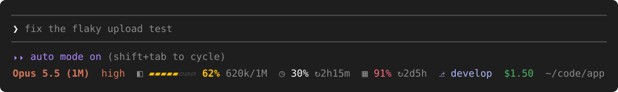

# statusbar

**One colored status line for Claude Code, drawn right under the prompt.**

Model, effort, context, 5-hour and weekly limits, git branch, session cost and directory — in a single row that fits itself to the terminal's width.



<sub>An illustration of the layout. The real colors come from your Claude Code theme, and the glyphs from your terminal font.</sub>

statusbar is a Claude Code [mod](https://code.claude.com/docs/en/plugins/mods/overview): a plugin of function hooks that reads Claude Code's own session data and draws inside the terminal UI. There is no shell script to write and nothing to configure before it works.

## Based on claude-statuspane

statusbar is a modified version of [**claude-statuspane**](https://github.com/xuanji86/claude-statuspane) by Anji Xu (MIT). statuspane draws a floating multi-row card above the prompt; statusbar keeps its figures and several of its helper functions and redraws them as one row under the prompt.

| | claude-statuspane | statusbar |
| --- | --- | --- |
| Where it draws | A bordered card above the prompt | One row under the prompt's hint line |
| Height | Several rows | One row |
| Labels | Text (`ctx`, `5h`, `7d`) | Icons (`◧`, `◷`, `▦`) |
| Settings | A clickable settings page | `/statusbar <part>` |
| GitHub CI rows | Yes (through `gh`) | Removed |
| Progress-row API for scripts and other mods | Yes | Removed |
| `⟲ compact` button | Yes | Removed |
| Commands it runs | `git`, and `gh` when CI is on | `git branch --show-current` only |

If you want the card, the CI rows or the progress API, use statuspane.

## What it shows

| Part | Example | Meaning |
| --- | --- | --- |
| `model` | `Opus 5.5 (1M)` | The model the session is using |
| `effort` | `high` | Reasoning effort of the current turn |
| `ctx` | `◧ ▰▰▰▰▰▱▱▱ 62% 620k/1M` | Context window: gauge, percent used, tokens used / window size |
| `5h` | `◷ 30% ↻ 2h15m` | 5-hour limit: percent used and time until it resets |
| `7d` | `▦ 91% ↻ 2d5h` | Weekly limit: percent used and time until it resets |
| `branch` | `⎇ develop` | Current git branch |
| `cost` | `$1.50` | Session cost so far |
| `dir` | `~/code/app` | Session directory, shortened when long |

The names in the first column are what `/statusbar <part>` takes.

A part appears once Claude Code has a figure for it; the limits appear only on a subscription plan.

The context figure comes from the model's last response. In a new session, and right after a compaction, there is none yet: the line then shows Claude Code's own estimate, the one `/context` counts, marked with `~` (`◧ ▱▱▱▱▱▱▱▱ ~4% 44k/1M`), until the next response reports the real figure. The two can differ by a few points. Where no estimate is available either, the part reads `◧ —`.

### Colors

Colors are theme keys, so the line follows your Claude Code theme (dark, light, colorblind-friendly).

| What | Color |
| --- | --- |
| Model | Claude accent, bold |
| Effort | Claude accent |
| Context gauge and percent | Accent; the theme's warning color from 50%, its error color from 80% |
| Limit percent | Plain text; warning color from 60%, error color from 85% |
| Branch | The theme's `suggestion` color |
| Cost | The theme's `success` color |
| Icons, token counts, countdowns, directory | Dim |

### Fitting the terminal

The line never wraps. As the terminal narrows, parts give way in this order: the directory, the reset countdowns, the effort, the token counts, the tail of a long branch name, the cost, the gauge, and then whole parts. The context percent is the last thing left.

```text
120 columns  Opus 5.5 (1M)  high  ◧ ▰▰▰▰▰▱▱▱ 62% 620k/1M  ◷ 30% ↻ 2h15m  ▦ 91% ↻ 2d5h  ⎇ develop  $1.50  ~/x
 80 columns  Opus 5.5 (1M)  high  ◧ ▰▰▰▰▰▱▱▱ 62% 620k/1M  ◷ 30%  ▦ 91%  ⎇ develop  $1.50
 56 columns  Opus 5.5 (1M)  ◧ ▰▰▰▰▰▱▱▱ 62%  ◷ 30%  ▦ 91%  ⎇ develop
 40 columns  Opus 5.5 (1M)  ◧ 62%  ◷ 30%  ▦ 91%
 12 columns  ◧ 62%
```

The column counts are the room the line itself has, a few columns less than the terminal's width.

## Install

Requires a Claude Code version with mods (function hooks). Developed and tested on Claude Code 2.1.293. The mods API is early access and may change between releases.

In a Claude Code terminal session:

```text
/plugin marketplace add xing-shuai/claude-mod-statusbar
/plugin install statusbar@claude-mod-statusbar
```

Or from a shell:

```sh
claude plugin marketplace add xing-shuai/claude-mod-statusbar
claude plugin install statusbar@claude-mod-statusbar
```

Then run `/reload-plugins` in any session that is already open. Installed at the user scope, the line shows in every new session.

statusbar adds a row and replaces nothing: a `statusLine` you already have in `~/.claude/settings.json` keeps showing. It draws in the terminal only.

## Configure

Everything is done with one command, and the choices are remembered across sessions.

| Command | What it does |
| --- | --- |
| `/statusbar` | Hides the whole line, or shows it again |
| `/statusbar <part>` | Turns one part off, or back on |
| `/statusbar help` | Says what the command takes and which parts are on (any word it does not know does this) |

`<part>` is one of `model`, `effort`, `ctx`, `5h`, `7d`, `branch`, `cost`, `dir`.

For example, to drop the directory and the effort:

```text
/statusbar dir
/statusbar effort
```

Each toggle answers with the parts as they stand:

```text
statusbar: dir off. Showing: model, effort, ctx, 5h, 7d, branch, cost. Off: dir.
```

The icons, the separator and the thresholds are constants at the top of [`hooks/register.tsx`](hooks/register.tsx) (`ICONS`, `SEP`, `CTX_WARN`, `LIMIT_WARN`, …) if you want to change them in your own copy.

## What it reaches

Everything stays on your machine. statusbar:

- reads Claude Code's own session data: model, effort, context usage, rate limits, cost and working directory;
- reads the `HOME` (or `USERPROFILE`) environment variable, to shorten the directory to `~`;
- runs `git branch --show-current` in the session's directory, every 30 seconds and after each turn, when the directory is a git repository;
- stores two preferences in the plugin's own store: whether the line is hidden, and which parts are off.

It makes no network requests and reads or writes no files of its own. `claude plugin validate` on a clone lists every hook and call.

## Uninstall

```sh
claude plugin uninstall statusbar@claude-mod-statusbar
claude plugin marketplace remove claude-mod-statusbar
```

## Development

```sh
git clone https://github.com/xing-shuai/claude-mod-statusbar
cd claude-mod-statusbar
claude plugin validate .
claude plugin test .
claude --plugin-dir .        # load the working copy for one session
```

A session that loads the mod from a folder reloads it when a file is saved.

## License

[MIT](LICENSE). Portions © 2026 Anji Xu ([claude-statuspane](https://github.com/xuanji86/claude-statuspane)).
